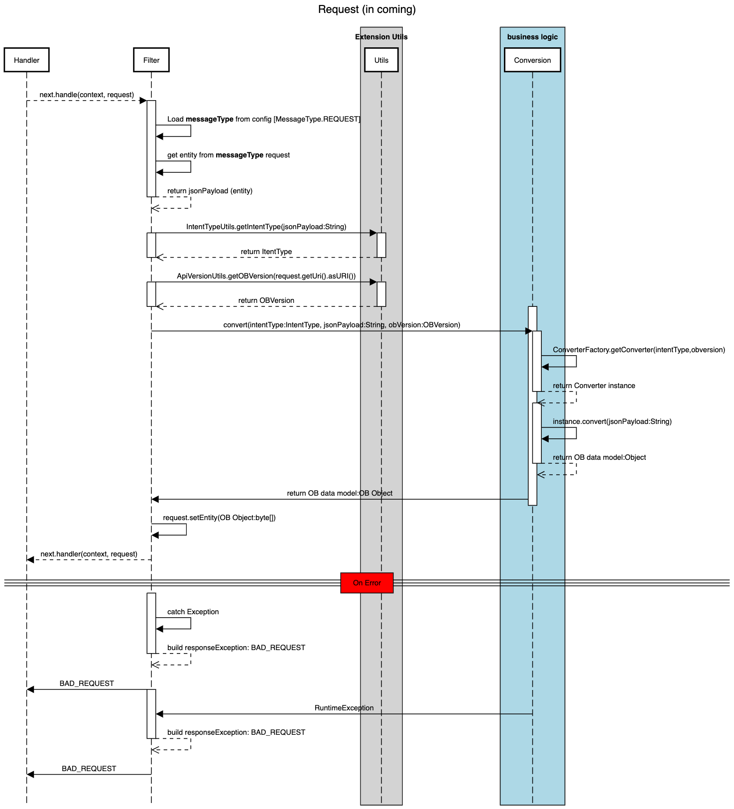
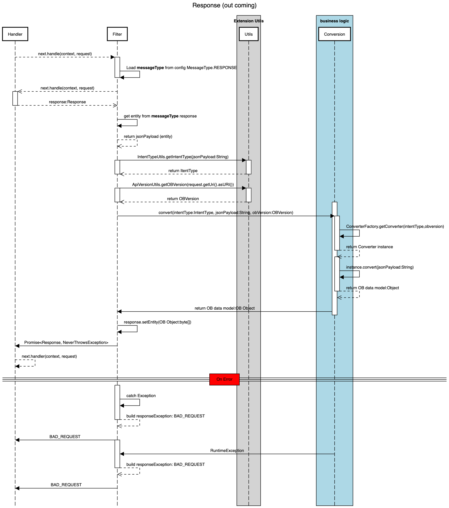

## Conversion Filter module

This filter module implements the below components:

- A filter to convert IDM intent object represented as json payload intent to OB data model consent response object.
- A inner heaplet static class to initialize the `IntentConverterFilter` in a heap environment
- A Class alias resolver to allow the use of short name `IntentConverterFilter` instead of fully qualified class name.

## Sequences
**Request sequence**

**Response sequence**


## Configuration

| field         | description                                                                                          | required | default         |
|---------------|------------------------------------------------------------------------------------------------------|----------|-----------------|
| `messageType` | The type of message for which to convert the entity and update the message with the converted result | Yes      | N/A             |                                            | No       | `REQUEST`       |

## Build

```shell
mvn clean install
```

> Each module is configured using maven plugins to copy the generated library in `config/7.0/obdemo-bank/ig/lib` when
> necessary

:nut_and_bolt: **Test purpose**

If you want test the provided module configuration for test purposes you need to run maven with the
profile `test-configuration`

```shell
mvn clean install -Ptest-configuration
```

> This command will copy the generated libraries and the provided configuration of routes and scripts module for test
> purposes in `config/7.0/obdemo-bank/ig/*`

:warning: Remember don't push the configuration for test purposes to git.

### Filter configuration examples

Check the content folder `${basedir}/configuration/routes`

